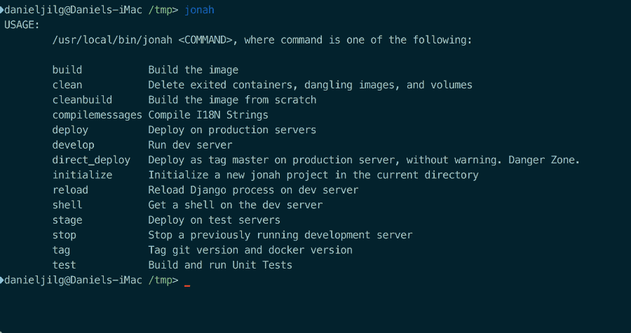

# Jonah is a way to pack your Django Development, Deployment and Testing into Docker

## Installation and Configuration

Prerequisites right now are 
 - your Django project needs to be called `ddp` for "Docker deployable project".
 - you have Python 2.7 or 3.5 installed
 - the jonah is included as a subfolder (we use submodules usually) next to your ddp project
 - this subfolder is called `deployment`

Once you have the prerequisites met, symlink the Dockerfile and .dockerignore into your root directory:

    > cd /my/project/dir
    > ln -s deployment/Dockerfile .
    > ln -s deployment/.dockerignore .
    
To configure, copy `deploy.ini.sample` to your main directory and rename it to `deploy.ini`. Then edit
it to include your requirements.

    > cd /my/project/dir
    > cp deployment/deploy.ini.sample deploy.ini
    
### Configuration Files

These files need to live in your main project dir for jonah to find:

 - `requirements.txt` This file is in Pip-Syntax. Python packages found here will be installed
   into the Docker container. (Note that jonah has its own requrements.txt already, which includes 
   a fairly inclusive list of Django packages. This file should just contain your addons to that.)
 - `apt-packages.txt` This file is in apt-get syntax. System packages that will be installed
   after basic system installation is complete.
 - `supervisord_local.conf` Additional config for supervisord. The file's contents will be appended 
   to `supervisord.conf` on build.
 - `system_initialization.sh` A shell script to run after the system installation has finished.
 - `ddp/test.sh` A shell script to run your tests. In many cases, this should just contain 
   `manage.py test`, but maybe you want to create code coverage, or include nose, or transform
   unit test results to other formats for your build server to use.

## deploy.py

You can use the `deploy.py` script to automatically build, run, and deploy the Docker container. Before
you run `deploy.py`, make sure that you are in a shell environment that can run Docker commands (e.g.
`docker ps` does not throw any errors).

The following is a list of commands you can use:

- `deploy.py build` Builds the docker image
- `deploy.py develop` Builds the docker image and runs a development server on it. You can access the server by 
   pointing your browser to http://localhost/
- `deploy.py reload` Reloads the running development server
- `deploy.py shell` Opens a shell within the container
- `deploy.py test` Builds and runs tests
- `deploy.py deploy` Builds the image and pushes it to the production repository

To get a full list of commands, run `deploy.py` without any arguments. 

## Development

No official road map is in place to date, but here are a few of the problems we'd like to tackle or see
tackled in the future:

 - **Init Command.** As it is, you'll have to create the proper document structure for the commands to 
   work yourself. An "init" command should solve that. Failing that, we'll try to provide an example
   project to get you started.
 - **Better Documentation**
 - **Pip Packaging.** Being able to `pip install jonah` would be nice.
 - **Live output of docker output.** Right now, capture the output of any Docker command, and display
   it once it's done running. This is annoying for long-running commands, so we'd like to print that
   output as it's happening.
 - **Better configuration options.** Right now, you have to change various files to update Django
   or the base requirements. We want that to be easier.

## Help Out and Code of Conduct

We'd like to encourage your feature requests, bug reports and pull requests. Please note that the
[Django Code of Conduct](https://www.djangoproject.com/conduct/) applies to this project. Be friendly,
welcoming, considerate, respectful, and be careful in the words that you choose please. If you think 
you've witnessed a CoC violation, please contact Daniel.

## Heritage

Jonah is inspired by [Joe Mornin's excellent `django-docker`](https://github.com/morninj/django-docker). 

## License

This project is released under the MIT license. See the `LICENSE` file for more info. 
